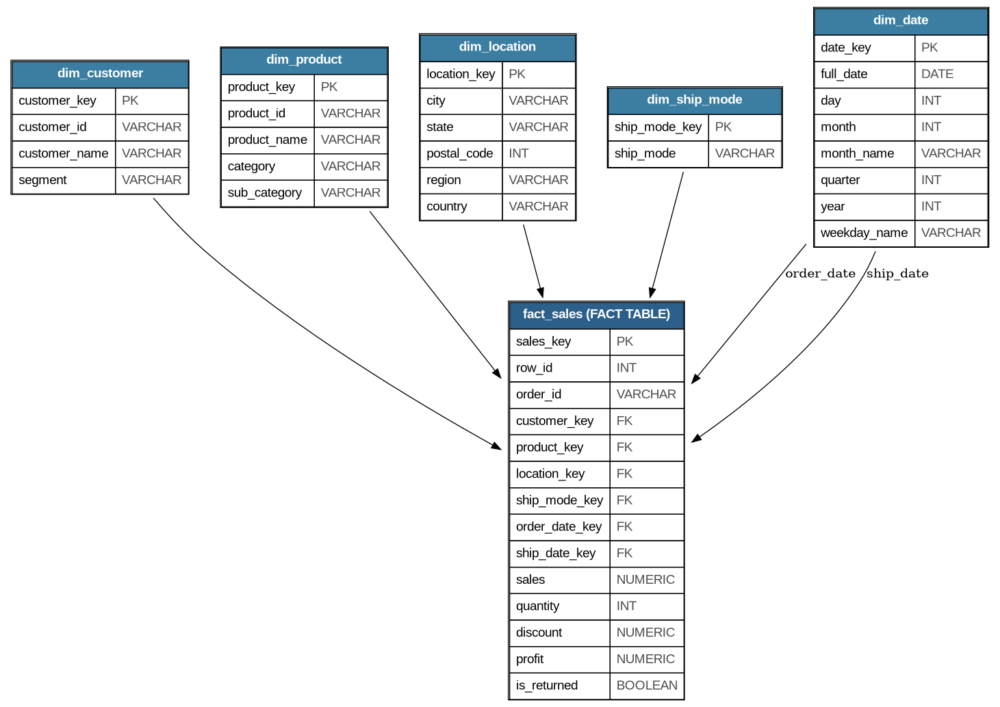
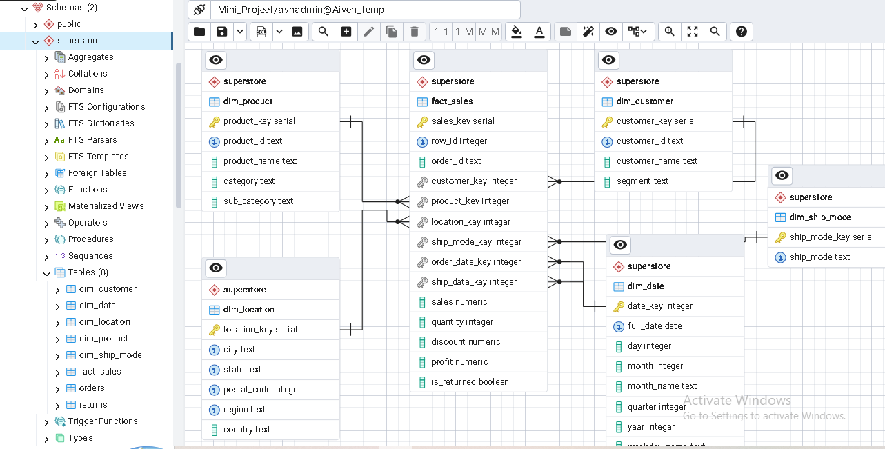

# Superstore Data Warehouse & Business Analytics

A PostgreSQL data warehouse built from raw Superstore retail transaction data (9,994 orders,
4 US regions). The project transforms unnormalized sales data into a Star Schema optimized
for executive reporting and KPI monitoring.

## What I Did
- Designed and implemented a Star Schema: 5 dimension tables (customer, product, location,
  ship mode, date) and 1 fact table, fully normalized with PK/FK relationships
- Built an ETL pipeline (Python + SQLAlchemy) to load and transform raw Excel data into PostgreSQL
- Resolved real data quality issues during ETL (inconsistent product names, duplicate
  returns records, missing postal codes)
- Wrote 15 analytical SQL queries covering profitability, customer behavior, and sales
  trends — using JOINs, CTEs, CASE statements, subqueries, and window functions
- Created a SQL View for profitability reporting and a parameterized Function for
  on-demand customer KPIs
- Added indexing on all foreign keys and frequently filtered columns to optimize query performance

## Key Findings:-

- **Furniture is the least profitable category**: it generates $742K in sales but only
  $18K in profit (2.5% margin) — far below Office Supplies (17.0%) and Technology (17.4%)
  
- **Tables and Bookcases are losing money**: these two sub-categories have *negative*
  profit margins (-8.6% and -3.0% respectively), despite generating over $320K in combined
  sales — likely due to high discounting

- **10 states operate at a net loss**, led by Texas (-$25.7K), Ohio (-$17.0K), and
  Pennsylvania (-$15.6K) — worth investigating discount policy or shipping costs in
  these states

- **The West region is the strongest performer**: highest profit ($108K) despite not
  having the highest sales, giving it the best profit efficiency of all 4 regions

- **Consumer segment drives the business**: 58% of total profit comes from the Consumer
  segment alone, more than Corporate and Home Office combined

- **Sales grew 51% from 2016 to 2019** ($484K → $733K), with the strongest single-year
  jump between 2018 and 2019 (+20%)

- **Standard Class shipping dominates**: used in 60% of all orders, more than the other
  three shipping modes combined

- **Return rate is 5.9%** (296 of 5,009 distinct orders) — a reasonable benchmark to
  track for future improvement efforts

## Screenshots

## Tools
PostgreSQL, Python (Pandas, SQLAlchemy)
